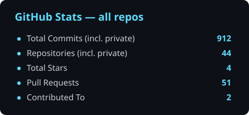
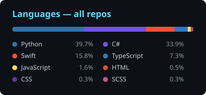
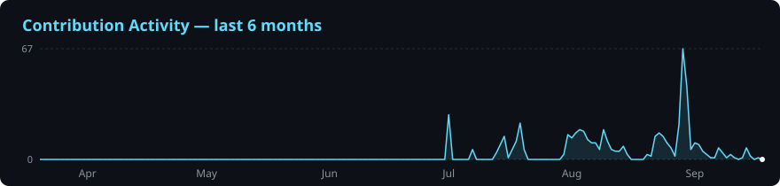

**Senior Frontend Developer** with **6+ years** of commercial experience — CRM platforms, fintech products, dashboards, marketplaces and real-time interfaces.

Founder of **[LinCode](https://t.me/lincode_x)** — an online programming school focused on modern frontend development.

---

## 🚀 What I Do

- 🏗 Design **scalable frontend architecture** (Feature-Sliced Design, modular systems)
- 💼 Build **CRM & enterprise platforms** — RBAC, analytics dashboards, complex business flows
- 💸 Ship **fintech interfaces** — trading, deposits/withdrawals, payment provider integrations
- ⚡ Work with **real-time data** — WebSockets, live dashboards, notifications
- 🔐 Implement **auth flows** — JWT, token refresh, role-based access
- ♻️ Modernize **legacy frontends** and migrate UI libraries
- 🎓 Mentor developers and teach frontend at **LinCode** (100+ students)

## 🛠 Tech Stack

**Core**

**State & Data**

**UI Libraries**

**Backend & Tools**

## 📊 GitHub Stats

## 📂 Featured Projects

| Project | Description | Stack |
|---------|-------------|-------|
| [mac-dynamic-island](https://github.com/linkoln-1/mac-dynamic-island) | Dynamic Island for the MacBook notch — screenshot buffer, Now Playing, AI agent monitor (Claude Code / Codex) | Swift, SwiftUI, AppKit |

## 🎓 LinCode School

Founder & instructor. Program: **HTML/CSS → JS Core & Advanced → Git → TypeScript → React → Next.js → state management → commercial projects.**

> **100+ students**, several graduates already work as professional developers.

